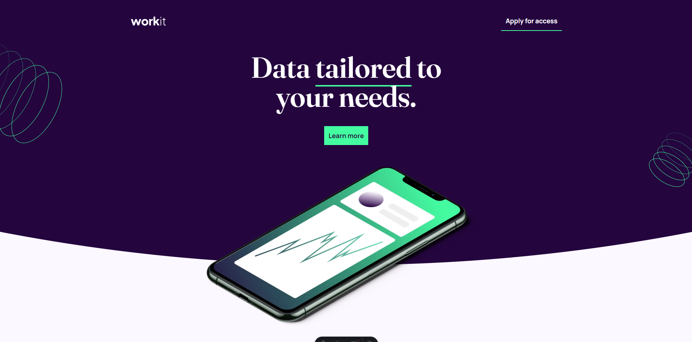
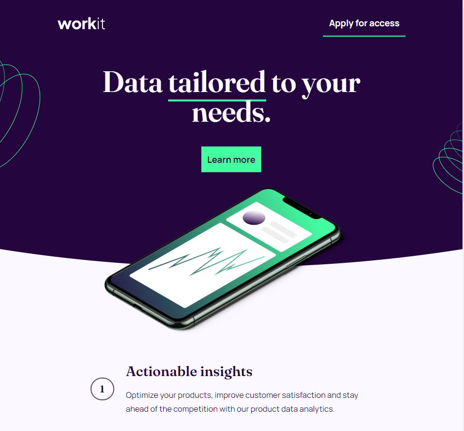
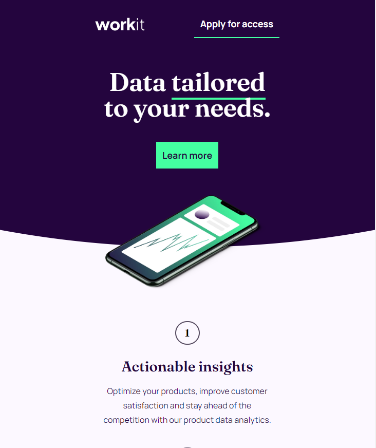

# Frontend Mentor - Workit landing page solution

This is a solution to the [Workit landing page challenge on Frontend Mentor](https://www.frontendmentor.io/challenges/workit-landing-page-2fYnyle5lu). Frontend Mentor challenges help you improve your coding skills by building realistic projects. 

## Table of contents

- [Overview](#overview)
  - [The challenge](#the-challenge)
  - [Screenshot](#screenshot)
  - [Links](#links)
- [My process](#my-process)
  - [Built with](#built-with)
  - [What I learned](#what-i-learned)
  - [Continued development](#continued-development)
- [Author](#author)

## Overview

### The challenge

Users should be able to:

- View the optimal layout for the interface depending on their device's screen size
- See hover and focus states for all interactive elements on the page

### Screenshot

#### Desktop

#### Table

#### Movil

### Links

- Solution URL: [Add solution URL here](https://your-solution-url.com)
- Live Site URL: [Add live site URL here](https://your-live-site-url.com)

## My process

### Built with

- Semantic HTML5 markup
- Flexbox
- CSS Grid
- Mobile-first workflow
- [Astro](https://astro.build/) - JS library
- [Tailwind](https://tailwindcss.com/) - React framework

### What I learned

I learned to handle less elements in the absolute position since both the background and the images were complicated to make

### Continued development

Continue practicing this type of exercise to reinforce the knowledge acquired

## Author

- Website - [Jazziel Puente](https://jazziel.dev/)
- Frontend Mentor - [@jazzielp](https://www.frontendmentor.io/profile/jazzielp)
- Twitter - [@hpuente06](https://twitter.com/hpuente06)
